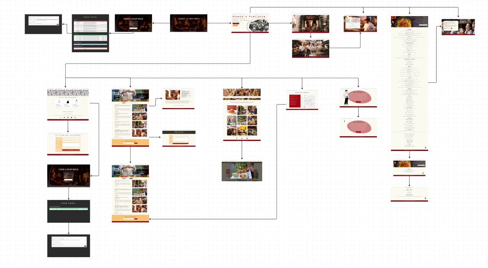

# Vinnie's Trattoria Website


## Overview
Vinnie's Trattoria Website is a beautifully designed, user-friendly platform tailored to showcase the charm and authenticity of a trattoria-style restaurant. The website highlights the menu, ambiance, and unique offerings of Vinnie's Trattoria while providing visitors with a seamless browsing experience. Additionally, the website features a blog section where staff can share updates, recipes, and stories, as well as an admin panel for managing content and operations.

## Features
- **Homepage:**
  - Eye-catching banner image (see above) representing the essence of Vinnie's Trattoria.
  - Quick links to menu, reservations, blog, and contact information.
- **Menu Page:**
  - Full menu with detailed descriptions and enticing images.
- **Reservations:**
  - Online booking form to reserve tables effortlessly.
- **Blog Section:**
  - Staff can post updates, recipes, and behind-the-scenes stories.
  - Organized with categories and tags for easy navigation.
- **Contact Page:**
  - Map integration, address, and direct contact form for inquiries.
- **Mobile-Friendly:**
  - Fully responsive design ensuring compatibility across all devices.
- **Admin Panel:**
  - Built with PHP for managing menu items, blog posts, reservations, and user accounts.

## Technologies Used
- **Frontend:**
  - HTML5
  - CSS3
  - JavaScript (ES6+)
- **Backend:**
  - PHP (for admin functionalities)
- **Libraries/Frameworks:**
  - Bootstrap
  - Font Awesome
- **Database:**
  - MySQL (for storing menu items, blog posts, reservations, etc.)
- **Tools:**
  - Visual Studio Code
  - Git/GitHub

## Installation

1. Clone the repository:
   ```bash
   git clone https://github.com/OJOCoding/VinniesTrattoria.git
   cd VinniesTrattoria
   ```

2. Set up a local server (e.g., XAMPP or WAMP) to run the PHP backend and MySQL database.

3. Import the database:
   - Locate the `database.sql` file in the repository.
   - Import it into your MySQL server using a tool like phpMyAdmin.

4. Update the database configuration:
   - Edit the `config.php` file in the `admin/` directory to match your database credentials.

5. Install frontend dependencies (if any):
   ```bash
   cd client
   npm install
   ```

6. Run the application:
   - Start your local server and ensure PHP and MySQL are running.
   - Open `index.html` in your browser to view the website.
   - Access the admin panel by navigating to `http://localhost/admin/`.

## Project Structure
```plaintext
VinniesTrattoria/
├── admin/              # Admin panel (PHP backend)
│   ├── config.php      # Database configuration
│   ├── dashboard.php   # Admin dashboard
│   ├── ...             # Other admin functionalities
├── blog/               # Blog-related files
│   ├── posts/          # Blog post content
│   ├── categories/     # Blog categories
├── css/                # Stylesheets
├── img/                # Images used in the website
├── js/                 # JavaScript files
├── index.html          # Main HTML file
├── about.html          # About page
├── contact.html        # Contact page
├── README.md           # Project documentation
├── database.sql        # Database schema and initial data
└── LICENSE             # License file
```

## Usage
- **Local Development:**
  - Open the `index.html` file directly in a browser to view the website.
  - Access the admin panel to manage content.
- **Customization:**
  - Update CSS in the `css/` directory to modify the design.
  - Edit HTML, PHP, or JavaScript files to add or modify functionality.

## Contributing
Contributions are welcome! To contribute:
1. Fork the repository.
2. Create a new branch for your changes:
   ```bash
   git checkout -b feature-name
   ```
3. Commit your changes and push to your fork.
4. Open a pull request detailing your updates.

## License
This project is licensed under the [MIT License](LICENSE).

## Contact
For any questions or support, please reach out:
- GitHub: [OJOCODING](https://github.com/OJOCODING)
- Email: [oniluca@ymail.com](mailto:oniluca@ymail.com)

---

Thank you for visiting the Vinnie's Trattoria Website project! We hope you enjoy the experience.
